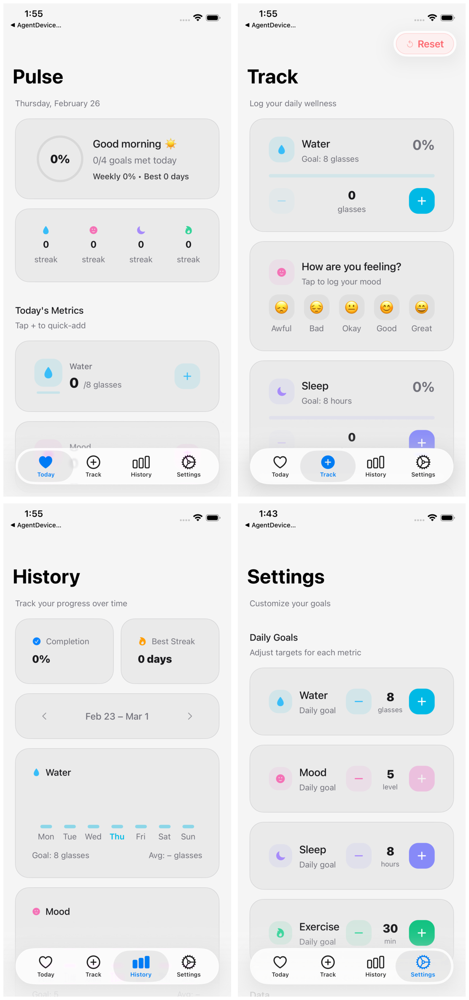

# Pulse

A local-first wellness tracker built with Expo + React Native.

## Demo

https://github.com/user-attachments/assets/7abd3c67-cd81-42bf-b455-ab77da4cbd4f

<picture>
  <source media="(prefers-color-scheme: dark) and (max-width: 767px)" srcset="./media/readme/screenshot-dark-mobile.png">
  <source media="(prefers-color-scheme: dark) and (min-width: 768px)" srcset="./media/readme/screenshot-dark-desktop.png">
  <source media="(prefers-color-scheme: light) and (max-width: 767px)" srcset="./media/readme/screenshot-light-mobile.png">
  <source media="(prefers-color-scheme: light) and (min-width: 768px)" srcset="./media/readme/screenshot-light-desktop.png">
  
</picture>

## Tech

- Expo Router
- React Native 0.83
- TypeScript
- Drizzle ORM + SQLite
- pnpm

## Quick start

Use Expo Go by default.

```bash
pnpm install
pnpm dev
```

Then press `i` (iOS simulator) or `a` (Android emulator) in the Expo CLI.

## Useful scripts

```bash
pnpm lint
pnpm format
pnpm typecheck
pnpm test
pnpm check:all
```

## Environment

Copy `.env.example` to `.env.local` if you need private Expo/EAS overrides.
